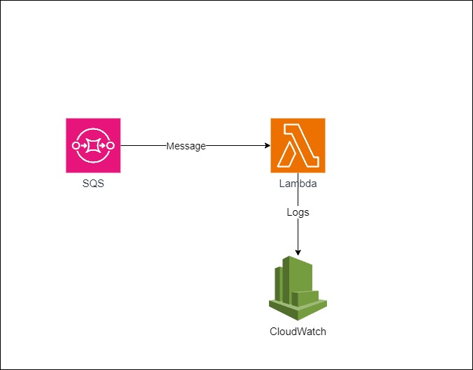

## 1. Infrastructure As Code mit Terraform

- SQS Queue mit
    - Queue Policy
    - Remote Trigger für Lambda
    - Terraform Output für Queue URL 

- Lambda Function 
    - Execution Role mit access zur SQS Queue für `sqs:*` Actions
    - Lambda Code

## 2. Teste den Consumer

- QUEUE_URL & Profile in shell datei ändern
- `./test.sh` ausführen

# Ende
